## Backend(Python) con Django - Sesion 2

Instalar libreria

1. Instalar a traves del pipenv
   
       $ pipenv install psycopg2-binary==2.8.6

Configurar base de datos

Settings

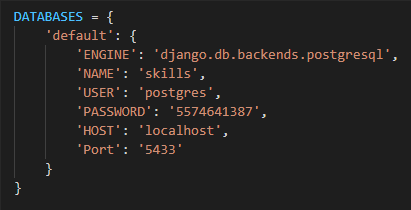

Crear el proyecto Books

    $  python manage.py startapp books

Crear los modelos 

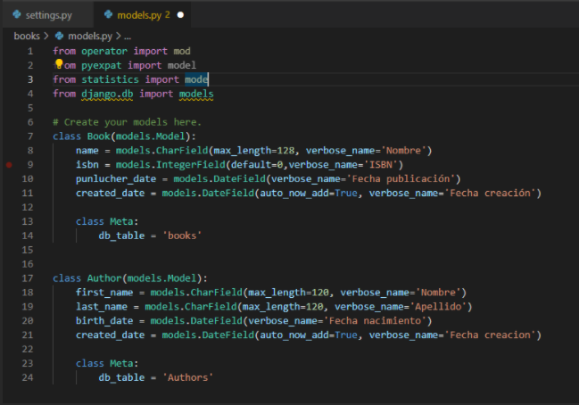

Crear una migración

    $ python manage.py makemigrations

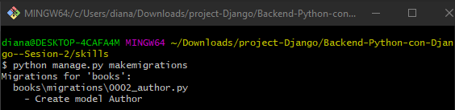

Visualización de los cambios

    $ python manage.py sqlmigrate books 0002

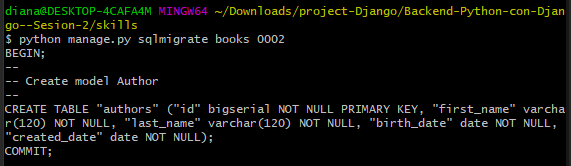

Generar transacción a la base de datos con el siguiente comando:

    $ python manage.py migrate

Generar realciones

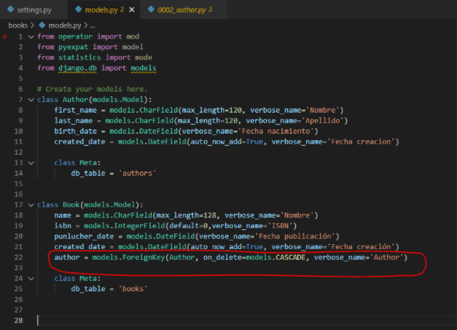

Realizar nuevamente el comando:

    $ python manage.py makemigrations

Como es una relación (un campo nuevo en una tabla que ya existe), preguntara lo siguiente: 

Seleccionamos la opción 2

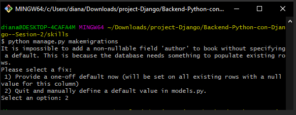

Agregamos esta parte:

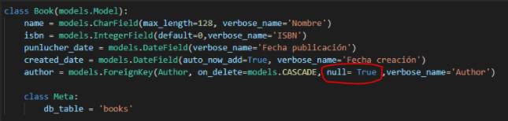

realizamos nuevamente la migración, ya no genera la pregunta anterior.

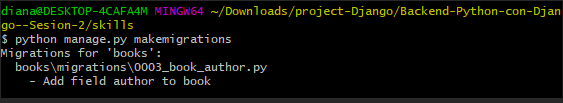

Hacer el migrate nuevamente

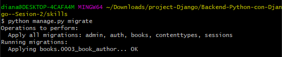

Verificamos las base de datos y las tablas que creamos:

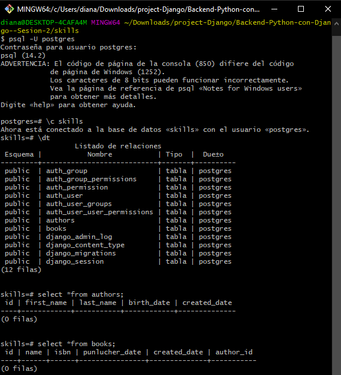

Realizar una **Vista** (tipo GET)

Modificar el archivo urls y views

    $ python manage.py runserver 0.0.0.0:8000

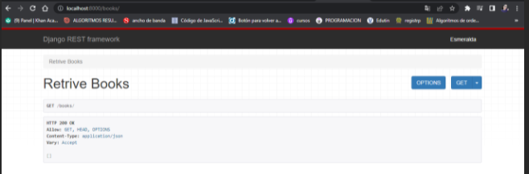

Realizar una **Vista** (tipo POST)

Modificar el archivo urls y views

Visualizar la vista con el siguiente comando y al momento de entrar al servidor colocar  /authors/create/ ()

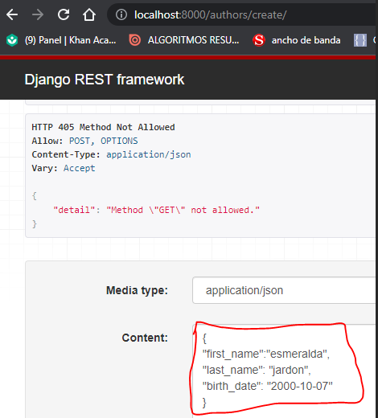

Agregamos contenido y manda el mensaje de creado

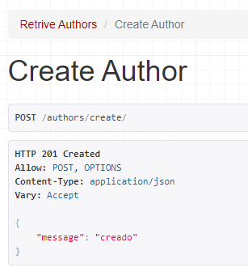

verificamos en la parte de authors

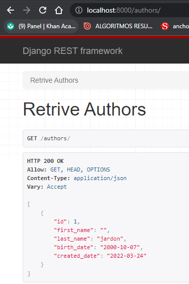

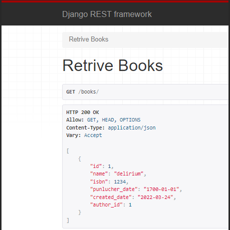

Visualisación los registros de forma grafica en PostgreSQL

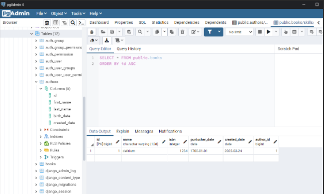